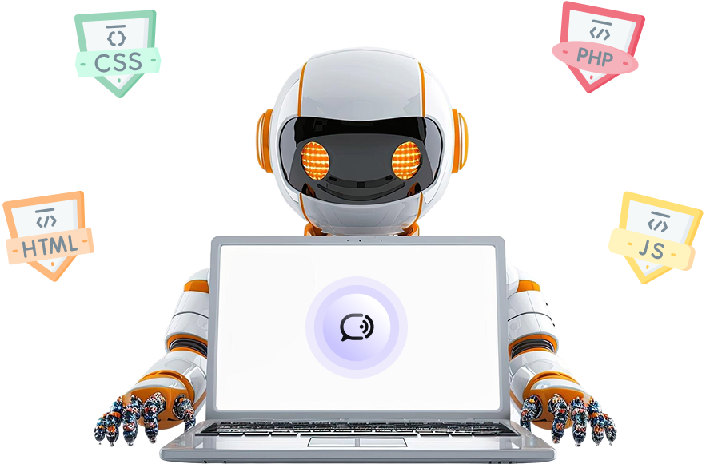

# 🚀 PrepWise - AI-Powered Hiring & Interview Solution

> **Revolutionizing the hiring process with cutting-edge AI technology**

PrepWise is not just a mock interview platform—it's the foundation of a comprehensive AI-based hiring solution designed to transform how companies recruit talent and how candidates prepare for opportunities. Built with Next.js 15, TypeScript, and integrated with powerful AI services, PrepWise provides end-to-end hiring solutions with real-time feedback, advanced analytics, and intelligent matching systems.

**Vision**: To build PrepWise into a full-fledged company that revolutionizes the hiring industry through AI-driven solutions.



## 🌟 Current Platform (V1.0) - Foundation Built

### Core Features Implemented

#### 🤖 **AI-Powered Interview System**
- **Advanced AI Interviewer**: Powered by VAPI AI with GPT-4 integration
- **Real-time Voice Conversations**: Natural voice interviews with 11Labs voice synthesis
- **Dynamic Question Generation**: Context-aware questions based on role and tech stack
- **Intelligent Feedback System**: Comprehensive performance analysis and scoring

#### 📊 **Performance Analytics Dashboard**
- **Detailed Scoring System**: 5 key categories - Communication, Technical Knowledge, Problem Solving, Cultural Fit, and Confidence
- **Progress Tracking**: Visual charts and progress indicators
- **Strengths & Improvement Areas**: Actionable insights for skill development
- **Interview History**: Complete record of past interviews with detailed feedback

#### 🔐 **Enterprise-Ready Authentication**
- **Firebase Authentication**: Secure user registration and login
- **Admin Panel Integration**: Firebase Admin SDK for backend user management
- **Role-Based Access Control**: Multi-tenant architecture ready

#### 🎨 **Professional UI/UX**
- **Enterprise-Grade Design**: Scalable, professional interface
- **Multi-Device Support**: Responsive design for all platforms
- **Brand Customization Ready**: Flexible theming system
- **Accessibility Compliant**: WCAG standards implemented

## 🏢 The Company Vision

### PrepWise: The Future of AI-Driven Hiring

PrepWise is evolving from a mock interview platform into a **comprehensive AI-based hiring ecosystem** that will revolutionize how companies find, evaluate, and hire talent while helping candidates showcase their true potential.

#### 🎯 **Our Mission**
To eliminate bias, reduce hiring time, and create perfect matches between companies and candidates through advanced AI technology.

#### 🌍 **Market Opportunity**
- **$240B Global Recruitment Market**
- **Growing demand for AI-powered solutions**
- **Remote work driving need for better assessment tools**
- **Skills-based hiring trend accelerating**

## 🛠️ Tech Stack

### Frontend
- **Framework**: Next.js 15 with App Router
- **Language**: TypeScript
- **Styling**: Tailwind CSS with custom animations
- **UI Components**: Radix UI + shadcn/ui
- **Charts**: Recharts for data visualization
- **Icons**: Lucide React

### Backend & Services
- **Database**: Firebase Firestore
- **Authentication**: Firebase Auth
- **AI Services**: 
  - VAPI AI for voice conversations
  - OpenAI GPT-4 for intelligent responses
  - 11Labs for voice synthesis
  - Deepgram for speech transcription
- **Deployment**: Vercel (recommended)

### Key Integrations
- **@vapi-ai/web**: Real-time voice AI conversations
- **@ai-sdk/google**: Google AI integration
- **firebase**: Complete Firebase suite
- **zod**: Type-safe schema validation
- **react-hook-form**: Form management

## 📁 Project Structure

```
D:\jsm_mock_interview/
├── app/
│   ├── (auth)/                 # Authentication pages
│   │   ├── sign-in/
│   │   └── sign-up/
│   ├── (root)/                 # Main application pages
│   │   ├── interview/
│   │   │   ├── [id]/          # Dynamic interview pages
│   │   │   │   ├── feedback/  # Interview feedback page
│   │   │   │   └── page.tsx   # Interview conduct page
│   │   │   └── page.tsx       # Interview setup page
│   │   ├── layout.tsx         # Root layout
│   │   └── page.tsx           # Homepage
│   ├── api/
│   │   └── vapi/
│   │       └── generate/      # VAPI AI integration endpoint
│   ├── components/            # Reusable components
│   │   ├── Agent.tsx          # AI Agent component
│   │   ├── AuthForm.tsx       # Authentication forms
│   │   ├── InterviewCard.tsx  # Interview display cards
│   │   └── ...
│   ├── globals.css
│   └── layout.tsx
├── actions/                   # Server actions
│   ├── auth.action.ts         # Authentication logic
│   └── general.action.ts      # General app logic
├── components/ui/             # UI components
├── constants/
│   └── index.ts              # App constants and configurations
├── firebase/
│   ├── admin.ts              # Firebase Admin SDK
│   └── client.ts             # Firebase Client SDK
├── lib/
│   ├── utils.ts              # Utility functions
│   └── vapi.sdk.ts           # VAPI SDK configuration
├── public/                   # Static assets
│   ├── covers/               # Company logos
│   ├── robot.png            # AI robot image
│   └── ...
├── types/                   # TypeScript type definitions
│   ├── index.d.ts
│   └── vapi.d.ts
└── package.json
```

## 🚀 Getting Started

### Prerequisites
- Node.js 18+ 
- npm/yarn/pnpm
- Firebase account
- VAPI AI account
- OpenAI API key
- 11Labs API key (optional)

### Environment Setup

1. **Clone the repository**
```bash
git clone <your-repo-url>
cd jsm_mock_interview
```

2. **Install dependencies**
```bash
npm install
# or
yarn install
# or
pnpm install
```

3. **Environment Variables**
Create a `.env.local` file in the root directory:

```env
# Firebase Configuration
NEXT_PUBLIC_FIREBASE_API_KEY=your_firebase_api_key
NEXT_PUBLIC_FIREBASE_AUTH_DOMAIN=your_project.firebaseapp.com
NEXT_PUBLIC_FIREBASE_PROJECT_ID=your_project_id
NEXT_PUBLIC_FIREBASE_STORAGE_BUCKET=your_project.appspot.com
NEXT_PUBLIC_FIREBASE_MESSAGING_SENDER_ID=your_sender_id
NEXT_PUBLIC_FIREBASE_APP_ID=your_app_id

# Firebase Admin (Server-side)
FIREBASE_PRIVATE_KEY=your_private_key
FIREBASE_CLIENT_EMAIL=your_service_account_email
FIREBASE_PROJECT_ID=your_project_id

# VAPI AI
VAPI_API_KEY=your_vapi_api_key
NEXT_PUBLIC_VAPI_PUBLIC_KEY=your_vapi_public_key

# OpenAI
OPENAI_API_KEY=your_openai_api_key

# 11Labs (Optional)
ELEVENLABS_API_KEY=your_elevenlabs_api_key
```

4. **Firebase Setup**
   - Create a new Firebase project
   - Enable Authentication with Email/Password
   - Create Firestore database
   - Download service account key for Admin SDK
   - Configure security rules

5. **VAPI AI Setup**
   - Sign up for VAPI AI account
   - Get API keys from dashboard
   - Configure voice settings

### Running the Application

```bash
# Development server
npm run dev

# Production build
npm run build
npm start

# Linting
npm run lint
```

Open [http://localhost:3000](http://localhost:3000) in your browser.

## 🎯 Key Features in Detail

### Interview Flow
1. **Setup**: Users select role, experience level, and tech stack
2. **Configuration**: AI generates personalized questions
3. **Interview**: Real-time voice conversation with AI
4. **Analysis**: Comprehensive feedback and scoring
5. **Review**: Detailed performance metrics and improvement suggestions

### AI Capabilities
- **Context-Aware Responses**: Understands technical concepts and responds appropriately
- **Adaptive Questioning**: Adjusts difficulty based on user responses
- **Behavioral Assessment**: Evaluates soft skills and communication
- **Technical Evaluation**: Tests coding knowledge and problem-solving

### Analytics Dashboard
- **Performance Trends**: Track improvement over time
- **Skill Breakdown**: Detailed analysis by category
- **Comparison Metrics**: Benchmark against other users
- **Recommendations**: Personalized learning paths

## 🚀 Company Roadmap: Building the Future

### Phase 2 (Q2-Q3 2025) - Enhanced Interview Platform
- [ ] **Live Code Editor**: Real-time coding interviews with AI code review
- [ ] **Video Analysis**: AI-powered body language and communication analysis
- [ ] **Multi-language Support**: Global candidate assessment capabilities
- [ ] **Industry-Specific Modules**: Tailored assessments for different sectors
- [ ] **Team Interview Simulations**: Group dynamics evaluation
- [ ] **Skills Verification System**: Blockchain-based credential verification

### Phase 3 (Q4 2025-Q2 2026) - Full Hiring Ecosystem
- [ ] **Recruiter Command Center**: Complete hiring management dashboard
- [ ] **AI Candidate Matching**: Intelligent job-candidate pairing system
- [ ] **Automated Screening Pipeline**: End-to-end recruitment automation
- [ ] **Company Culture Analysis**: AI-driven culture fit assessment
- [ ] **Predictive Hiring Analytics**: Success prediction models
- [ ] **Mobile Applications**: Full-featured iOS and Android apps

### Phase 4 (2026-2027) - Enterprise & Scale
- [ ] **White-Label Solutions**: Complete hiring platforms for enterprises
- [ ] **API Marketplace**: Third-party integrations ecosystem
- [ ] **Global Talent Pool**: International candidate database
- [ ] **AI Bias Detection**: Fairness and diversity monitoring systems
- [ ] **Custom Training Programs**: Personalized skill development paths
- [ ] **Acquisition Targets**: Strategic company acquisitions

### Phase 5 (2027+) - Market Leadership
- [ ] **IPO Preparation**: Public company transition
- [ ] **International Expansion**: Global market penetration
- [ ] **AI Research Lab**: Cutting-edge hiring technology development
- [ ] **University Partnerships**: Campus recruitment solutions
- [ ] **Government Contracts**: Public sector hiring solutions

## 💼 Business Model Strategy

### Revenue Streams
1. **SaaS Subscriptions**: Tiered pricing for different company sizes
2. **Per-Assessment Pricing**: Pay-per-use model for smaller companies
3. **Enterprise Licenses**: Custom solutions for large corporations
4. **API Access**: Developer and integration partner fees
5. **Premium Features**: Advanced analytics and reporting
6. **Certification Programs**: Skill verification and credentialing

### Target Markets
- **Tech Companies**: Software engineering and technical roles
- **Consulting Firms**: Business and analytical positions
- **Financial Services**: Quantitative and client-facing roles
- **Healthcare**: Specialized technical and patient care roles
- **Government**: Public sector recruitment optimization

## 🔧 Development

### Code Structure
- **App Router**: Using Next.js 15 App Router for optimal performance
- **Server Components**: Leveraging React Server Components
- **Type Safety**: Full TypeScript implementation
- **Component Architecture**: Reusable, modular components
- **State Management**: React hooks and server state

### Best Practices Implemented
- **Performance Optimization**: Image optimization, lazy loading
- **SEO Friendly**: Proper meta tags and structured data
- **Error Handling**: Comprehensive error boundaries
- **Security**: Input validation and sanitization
- **Testing Ready**: Structured for easy test implementation

## 🌐 Deployment

### Vercel (Recommended)
```bash
# Install Vercel CLI
npm i -g vercel

# Deploy
vercel
```

### Manual Deployment
1. Build the application: `npm run build`
2. Upload `out` folder to your hosting provider
3. Configure environment variables
4. Set up domain and SSL

## 📄 License

This project is built for educational and portfolio purposes. Feel free to use it as inspiration for your own projects.

## 👨‍💻 About the Founder

**Yash Malvi** - 4th-year CSE student and future CEO/CTO of PrepWise, passionate about AI, full-stack development, and revolutionizing the hiring industry.

### Vision Statement
*"To build PrepWise into a billion-dollar company that fundamentally transforms how the world hires talent through AI-powered solutions."*

### Background & Expertise
- 🎓 **Education**: 4th-year Computer Science Engineering student
- 🚀 **Specialization**: AI/ML, Full-Stack Development, System Design
- 💡 **Innovation Focus**: Cutting-edge AI applications in HR-Tech
- 🎯 **Mission**: Creating the world's most advanced hiring platform

### Contact & Investment Opportunities
- 📧 **Email**: yashlohar158@gmail.com
- 💼 **Open for**: Partnerships, Investment, Advisory Board positions
- 🌟 **Building**: The future of AI-driven recruitment technology
- 🚀 **Goal**: Scale PrepWise into a full-fledged unicorn company

### Why PrepWise Will Succeed
1. **Market Timing**: AI adoption in HR is accelerating rapidly
2. **Technical Excellence**: Built on cutting-edge AI technology
3. **Scalable Architecture**: Designed for enterprise-level deployment
4. **Clear Vision**: Comprehensive hiring ecosystem approach
5. **Execution Focus**: Strong development and business acumen

---

## 🚀 Quick Start Commands

```bash
# Clone and setup
git clone <repo-url> && cd jsm_mock_interview
npm install

# Configure environment
cp .env.example .env.local
# Add your API keys

# Start development
npm run dev
```

## 🌟 Join the Revolution

**Ready to be part of the future of hiring?**

### For Candidates
- 🎯 **Experience the future of interview preparation**
- 📈 **Get ahead with AI-powered skill development**
- 🏆 **Join thousands preparing for their dream careers**

### For Companies
- 🔍 **Discover top talent with AI precision**
- ⚡ **Reduce hiring time by 80%**
- 📊 **Make data-driven hiring decisions**

### For Investors & Partners
- 💰 **Join a high-growth AI company**
- 🚀 **Be part of the hiring revolution**
- 🌍 **Scale globally with proven technology**

**PrepWise: Where talent meets opportunity through AI** 🎯

---

*Built with ❤️ and ambitious vision using Next.js, TypeScript, and cutting-edge AI technology*

**© 2025 PrepWise Inc. - Revolutionizing Hiring Through AI**
